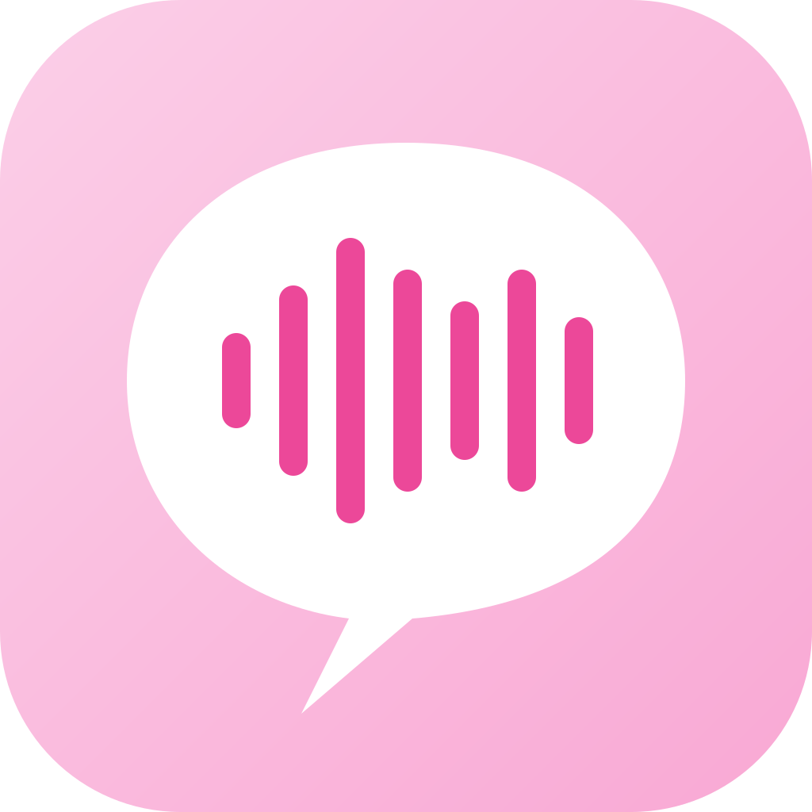

<p align="center">
  
</p>

# Voicey

Voicey is a macOS menubar app for system-wide voice-to-text dictation with fully on-device transcription. Current releases are Qwen-first, with native MLX inference, optional multi-process Rust workers, clipboard-first output, and optional auto-insert into the focused app.

## Features

- **On-device by default**: transcription, glossary steering, and optional OCR all stay on your Mac
- **Fast capture flow**: press a single hotkey to start/stop dictation (default: `Ctrl+V`)
- **Qwen3 ASR models**: Voicey ships a Qwen-first user experience with native Swift MLX inference
- **Smarter spelling**: bias recognition with a custom glossary plus text from the target app
- **Optional OCR assist**: fall back to on-device Vision OCR when Accessibility text is sparse
- **Clipboard-first output**: copy to clipboard by default, with optional auto-insert and clipboard restore
- **Voice commands**: built-in commands for `new line`, `new paragraph`, `scratch that`, and custom insertions
- **Background runtime helpers**: bundled builds can use Rust capture/fetch/supervisor workers on hot paths
- **Menubar-native UX**: no dock icon by default, lightweight overlay, launch-at-login support

## Requirements

- macOS 15.0 or later
- Apple Silicon (M1+) for the MLX / Metal runtime
- Microphone permission
- Network access for first-time model downloads
- Optional Accessibility permission for auto-insert and target-app text steering
- Optional Screen Recording permission for OCR-based screen context

## Build from Source

### Prerequisites

1. Xcode 15 or later
2. Swift 5.10 or later
3. macOS for build and runtime validation

Voicey is a macOS-only app. On Linux, you can still run package resolution, formatting, and linting, but not the full app build.

### Recommended development flows

```bash
cd voicey

# Recommended default: direct-distribution debug bundle
make run

# App Store-style debug bundle
make run-appstore

# Debug bundle with bundled Rust workers on the hot path
make run-multiprocess
```

### Build targets

```bash
# Raw debug build
make build

# Build Rust worker binaries used by bundled multiprocess flows
make build-rust

# App Store-style release bundle
make bundle

# Direct-distribution release bundle (Sparkle-enabled)
make bundle-direct

# Install the App Store-style bundle into /Applications
make install
```

### Open in Xcode

```bash
# Generate an Xcode project
make xcode

# Or open the package directly
open Package.swift
```

### Linux / CI-friendly commands

```bash
swift package resolve
swiftlint lint Sources/
swift-format -i -r Sources/
```

## Usage

### First launch

1. Launch Voicey from `Applications` or a built app bundle.
2. Grant microphone permission.
3. Download one of the Qwen3 ASR models.
4. Start dictating from the menubar or the global hotkey.

Voicey defaults to the recommended Qwen model for your machine:

- `Qwen3 ASR 0.6B (MLX)` on Macs with less than 16 GB RAM
- `Qwen3 ASR 1.7B (MLX)` on Macs with 16 GB RAM or more

### Dictation flow

1. Press `Ctrl+V` (or your custom shortcut) to start recording.
2. Speak naturally.
3. Press the hotkey again to stop and transcribe.
4. Press `Esc` to cancel.

### Settings

Access settings from the menubar icon:

- **General**: clipboard output, launch at login, dock icon visibility
- **Hotkey**: customize the dictation shortcut
- **Audio**: inspect the active input and test the microphone
- **Model**: select and download Qwen3 ASR models
- **Spelling & Context**: glossary steering, target-app text steering, optional OCR fallback
- **Voice Commands**: manage built-in and custom spoken editing commands
- **Advanced**: auto-insert, restore clipboard after paste, pause media during transcription, runtime diagnostics, update checks for direct installs

## Models

### User-facing models

| Model | Disk Size | Memory | Notes |
|-------|-----------|--------|-------|
| Qwen3 ASR 1.7B (MLX) | ~1.8GB | ~3.5GB | Recommended on 16 GB+ Macs; best quality |
| Qwen3 ASR 0.6B (MLX) | ~450MB | ~1.3GB | Faster startup and lower memory use |

### Additional benchmark / parity models in the repo

The codebase still includes WhisperKit and Granite backends for benchmarking, compatibility, and runtime-parity tooling, but the settings UI is intentionally Qwen-only.

## Output and post-processing

Voicey cleans up and delivers transcriptions with:

- **Text expansions and normalization** in the post-processing pipeline (Qwen path)
- **Whisper caption noise filtering** only for benchmark / segmented transcriptions (not used for Qwen)
- **Clipboard delivery** by default
- **Optional auto-insert** into the focused field using Accessibility
- **Optional clipboard restoration** after auto-insert
- **Voice commands** for line breaks, paragraph breaks, deleting the last utterance, and custom text expansions

## Runtime

Voicey supports both in-process and multiprocess transcription flows.

- Bundled builds can auto-enable Rust workers when present
- The multiprocess path can use `voicey-capture`, `voicey-fetch`, and `voicey-supervisor`
- Qwen inference can run in-process or through the infer-worker flow, depending on runtime configuration

See [`docs/RUST_RUNTIME.md`](docs/RUST_RUNTIME.md) for environment flags, bundled worker behavior, and runtime diagnostics.

## Architecture

For a compact system diagram, code map, runtime trade-offs, and guidance on where
new development should live, see [`docs/ARCHITECTURE.md`](docs/ARCHITECTURE.md).

```text
Sources/
├── Voicey/App             # App lifecycle, menubar, update integration
├── Voicey/Accessibility   # Accessibility and OCR-based screen context
├── Voicey/Audio           # Recording, waveform, duration limits
├── Voicey/Input           # Global hotkey management
├── Voicey/Output          # Clipboard, auto-insert, keyboard simulation
├── Voicey/Runtime         # Infer worker, Rust worker, diagnostics, supervisor
├── Voicey/Transcription   # Qwen, Whisper, Granite engines and model management
├── Voicey/UI              # Overlay, onboarding, settings
├── Voicey/Utilities       # Settings, permissions, notifications, localization
└── VoiceyCore             # Shared text cleanup and voice-command primitives
```

## Dependencies

- [speech-swift](https://github.com/soniqo/speech-swift) - native Swift MLX Qwen3 ASR runtime
- [WhisperKit](https://github.com/argmaxinc/WhisperKit) - Whisper/CoreML backend used for parity and benchmark tooling
- [KeyboardShortcuts](https://github.com/sindresorhus/KeyboardShortcuts) - global hotkey management
- [Sparkle](https://sparkle-project.org/) - direct-distribution auto-updates only

## Permissions

| Permission | Purpose |
|------------|---------|
| Microphone | Capture dictation audio |
| Network | Download speech models |
| Accessibility | Auto-insert text and read target-app text context |
| Screen Recording | OCR fallback for apps that expose little Accessibility text |

## License

This project is licensed under the MIT License. See [LICENSE](LICENSE).

## Acknowledgments

- Qwen for the ASR model family used in current releases
- Argmax for WhisperKit
- Soniqo for `speech-swift`
- Sindre Sorhus for KeyboardShortcuts
- Sparkle contributors for direct-distribution update tooling
