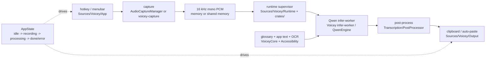

# Voicey system map

Tiny-context map for where code lives, why it exists, and where new work
should land. Voicey is a macOS menubar dictation app with local Qwen/MLX
transcription, optional Rust workers, clipboard-first output, and optional
Accessibility insertion.

## Code map

| Path | Purpose | Put new work here when... |
|------|---------|---------------------------|
| [`Sources/Voicey/App/`](../Sources/Voicey/App/) | App launch, `AppDelegate`, menubar, hotkey orchestration, state, DI, media pause, updates | It coordinates product flow or app lifecycle. Split from `AppDelegate` when adding a cohesive subsystem. |
| [`Sources/Voicey/UI/`](../Sources/Voicey/UI/) | Settings, overlay, waveform UI | It is SwiftUI/AppKit presentation. |
| [`Sources/Voicey/Audio/`](../Sources/Voicey/Audio/) | AVFoundation capture fallback, levels, waveform envelopes, recording limits, hands-free hooks | It touches mic input or capture-time audio shaping. |
| [`Sources/Voicey/Transcription/`](../Sources/Voicey/Transcription/) | Qwen/Whisper/Granite engines, model management, steering, post-processing, benchmark commands | It changes ASR, model downloads, decoder context, text cleanup after decode, or benchmark CLIs. |
| [`Sources/Voicey/Runtime/`](../Sources/Voicey/Runtime/) | Infer-worker, supervisor clients, worker config, JSONL IPC, shared-memory PCM | It crosses process boundaries or chooses in-process vs worker behavior. |
| [`Sources/Voicey/Accessibility/`](../Sources/Voicey/Accessibility/) | Target-app text and optional Vision OCR context | It harvests screen/app context for steering. |
| [`Sources/Voicey/Output/`](../Sources/Voicey/Output/) | Clipboard, Accessibility paste, keyboard simulation | It delivers transcription to the user. |
| [`Sources/Voicey/Utilities/`](../Sources/Voicey/Utilities/) | Settings, permissions, notifications, logging, localization | It is shared app plumbing. |
| [`Sources/VoiceyCore/`](../Sources/VoiceyCore/) | Foundation-only protocol mirrors, glossary, BM25, voice commands, text/screen-term logic, hands-free detector | It is pure logic that should run in Linux CI. Add tests in [`Tests/VoiceyCoreTests/`](../Tests/VoiceyCoreTests/). |
| [`crates/`](../crates/) | Rust protocol, PCM helpers, supervisor, capture/fetch workers, worker stubs, Rust text parity | It belongs in sandboxable workers or Linux integration tests. |
| [`scripts/`](../scripts/), [`Benchmarks/`](../Benchmarks/) | Release, restart, benchmark data, parity/eval harnesses | It is automation, evaluation, or release glue. |

## Runtime choices and trade-offs

| Hot path | Default when bundled | Fallback / override | Trade-off |
|----------|----------------------|---------------------|-----------|
| Mic capture | `voicey-capture` via [`AudioCaptureManager`](../Sources/Voicey/Audio/AudioCaptureManager.swift) | AVAudioEngine with `VOICEY_USE_RUST_CAPTURE=0` | Worker isolates capture and can return shared-memory PCM; Swift path is simpler while debugging. |
| Qwen inference | `Voicey infer-worker` through supervisor/client IPC | In-process `QwenEngine` with `VOICEY_RUNTIME=in-process` | Worker contains MLX memory/thermal spikes; in-process is easier to debug. |
| Audio handoff | POSIX shared memory (`SharedMemoryPCM`) | `[Float]` JSONL/in-memory path | Avoids copying large clips across processes; hands-free trimming may materialize samples. |
| Model download | `voicey-fetch` | Swift downloader with `VOICEY_USE_RUST_FETCH=0` | Worker narrows network/file authority; direct builds seatbelt it by default. |
| Steering | Glossary + Accessibility/OCR context before decode | Feature toggles in settings | Improves names and local terms; depends on optional privacy permissions. |
| Long clips | Qwen chunking/token budget in `QwenEngine` | None | More stable than one huge decode; chunk joins can lose cross-boundary context. |

Runtime reference: [`RUST_RUNTIME.md`](RUST_RUNTIME.md). IPC schema and versioning:
[`RUST_PROTOCOL.md`](RUST_PROTOCOL.md). Rust CI roadmap:
GitHub [#74](https://github.com/jonathanKingston/voicey/issues/74). Release note for
bundled Rust workers: [`CHANGELOG.md`](../CHANGELOG.md) /
[PR #52](https://github.com/jonathanKingston/voicey/pull/52).

## State and infrastructure

- Entry point: [`VoiceyApp.swift`](../Sources/Voicey/App/VoiceyApp.swift) handles
  `infer-worker` and benchmark CLI modes before launching the SwiftUI menubar app.
- Single UI state source: [`AppState`](../Sources/Voicey/App/AppState.swift)
  (`idle`, `loadingModel`, `waitingForSpeech`, `recording`, `processing`,
  `completed`, `error`).
- Dependency style: protocol-backed app services in
  [`Dependencies.swift`](../Sources/Voicey/App/Dependencies.swift); prefer injection
  for testable new managers.
- Package split: [`Package.swift`](../Package.swift) builds only `VoiceyCore` on
  Linux; the full app target requires macOS 15, SwiftUI/AppKit, AVFoundation,
  Metal, CoreML, MLX, and optional Sparkle for direct builds.
- CI: macOS build, Linux `VoiceyCore` tests, Rust workspace tests (toolchain pinned in
  [`rust-toolchain.toml`](../rust-toolchain.toml)), strict SwiftLint in
  [`.github/workflows/`](../.github/workflows/).

## Performance and quality guardrails

- Measure transcription with real-time factor (RTF); Qwen warns on high RTF or
  serious thermal state.
- Keep cross-process payloads small; use shared memory for audio and JSONL for
  control messages.
- Keep pure algorithms in `VoiceyCore` so Linux CI can cover them.
- For protocol changes: edit `crates/voicey-protocol`, bump versions on breaking
  changes, mirror in `Sources/VoiceyCore/VoiceyProtocol.swift`, run
  `make protocol-fixtures`.
- Coding standards live in [`AGENTS.md`](../AGENTS.md),
  [`.cursor/rules/swift-guidelines.mdc`](../.cursor/rules/swift-guidelines.mdc),
  [`.swiftlint.yml`](../.swiftlint.yml), and review history in
  [`CODE_REVIEW.md`](../CODE_REVIEW.md).

## Future improvement lanes

- Continue shrinking orchestration out of `AppDelegate` into focused app services.
- Preserve runtime parity between in-process and multiprocess Qwen paths with
  benchmark commands and golden fixtures.
- Expand Rust worker tests with stubs before changing supervisor/capture/fetch IPC.
- Keep direct vs App Store distribution differences explicit in entitlements,
  Sparkle docs, and sandboxed worker behavior.
- Defer non-macOS hosts unless the active product path changes; see
  [`CROSS_PLATFORM_DEFERRED.md`](CROSS_PLATFORM_DEFERRED.md).
