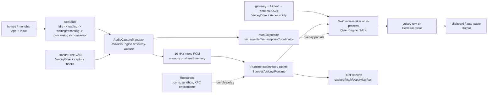

# Voicey system map

Tiny-context guide to where code lives, why it exists, performance trade-offs,
and where new development should land. Voicey is a macOS menubar dictation app:
local Qwen/MLX transcription, optional Rust workers, clipboard-first output, and
optional Accessibility insertion.

## Code map

| Path | Purpose | New work belongs here when... |
|------|---------|-------------------------------|
| [`Sources/Voicey/App/`](../Sources/Voicey/App/) | Launch, `AppDelegate`, menubar, hotkey orchestration, `AppState`, DI, media pause, Sparkle/direct-update glue, single-instance guard | It coordinates product flow or app lifecycle. Prefer extracting focused services instead of growing `AppDelegate`. |
| [`Sources/Voicey/Input/`](../Sources/Voicey/Input/) | Shortcut/keybinding capture UI plumbing | It records or edits user shortcuts. Global hotkey registration stays in `App/`. |
| [`Sources/Voicey/UI/`](../Sources/Voicey/UI/) | Settings, overlay, waveform UI | It is SwiftUI/AppKit presentation only. |
| [`Sources/Voicey/Audio/`](../Sources/Voicey/Audio/) | AVFoundation capture fallback, levels, waveform envelopes, recording limits, hands-free hooks | It touches mic input or capture-time audio shaping. |
| [`Sources/Voicey/Transcription/`](../Sources/Voicey/Transcription/) | Qwen/Whisper/Granite engines, model management, steering, post-processing, benchmark CLIs | It changes ASR, decoder context, text cleanup after decode, or model/eval commands. |
| [`Sources/Voicey/Runtime/`](../Sources/Voicey/Runtime/) | Infer-worker command, supervisor clients, worker config, JSONL IPC, shared-memory PCM, runtime diagnostics | It crosses process boundaries or chooses in-process vs worker behavior. |
| [`Sources/Voicey/Accessibility/`](../Sources/Voicey/Accessibility/) | Target-app Accessibility text and optional Vision OCR | It harvests on-screen/app context for steering. |
| [`Sources/Voicey/Output/`](../Sources/Voicey/Output/) | Clipboard, Accessibility paste, keyboard simulation | It delivers transcription to the user. |
| [`Sources/Voicey/Utilities/`](../Sources/Voicey/Utilities/) | Settings, permissions, notifications, logging, localization | It is shared app plumbing. |
| [`Sources/VoiceyCore/`](../Sources/VoiceyCore/) | Foundation-only protocol mirrors, glossary, BM25, voice commands, text/screen-term logic, hands-free detector | It is pure logic that should run in Linux CI. Add tests in [`Tests/VoiceyCoreTests/`](../Tests/VoiceyCoreTests/). |
| [`crates/`](../crates/) | Rust protocol, PCM helpers, supervisor, capture/fetch/text workers, Linux worker stubs | It belongs in sandboxable workers or Linux integration tests. |
| [`Resources/`](../Resources/) | Icons, [`VoiceyFetch.sb`](../Resources/Sandbox/VoiceyFetch.sb), XPC worker entitlements | It is bundled static app/worker policy. |
| [`scripts/`](../scripts/), [`Benchmarks/`](../Benchmarks/) | Release/restart automation, golden fixtures, Common Voice and runtime parity harnesses | It is automation, evaluation, or release glue. |

## Runtime workers

| Component | Owner | Role |
|-----------|-------|------|
| Infer | [`InferWorkerCommand.swift`](../Sources/Voicey/Runtime/InferWorkerCommand.swift), [`QwenEngine.swift`](../Sources/Voicey/Transcription/QwenEngine.swift) | Swift MLX subprocess or in-process engine. Not a Rust crate. |
| Supervisor | [`crates/voicey-supervisor/`](../crates/voicey-supervisor/) | Spawns/manages infer, capture, and fetch workers. |
| Capture | [`crates/voicey-capture/`](../crates/voicey-capture/) | cpal mic capture, hands-free drain IPC, shared PCM output. |
| Fetch | [`crates/voicey-fetch/`](../crates/voicey-fetch/) | Hugging Face listing/download, staged promote, direct-build sandboxing. |
| Text | [`crates/voicey-text/`](../crates/voicey-text/) | Rust post-processing parity with Swift `PostProcessor`. |
| Protocol/PCM | [`crates/voicey-protocol/`](../crates/voicey-protocol/), [`crates/voicey-pcm/`](../crates/voicey-pcm/) | JSONL schema source of truth and shared PCM temp-file helpers. |
| Test stubs | [`crates/voicey-worker-stubs/`](../crates/voicey-worker-stubs/) | Linux supervisor integration tests without MLX, mic, or network. |

Runtime reference: [`RUST_RUNTIME.md`](RUST_RUNTIME.md). IPC/versioning:
[`RUST_PROTOCOL.md`](RUST_PROTOCOL.md). Hands-free spec:
[`HANDS_FREE_RECORDING_MODE.md`](HANDS_FREE_RECORDING_MODE.md).

## Runtime choices and trade-offs

| Hot path | Default when bundled | Override / fallback | Trade-off |
|----------|----------------------|---------------------|-----------|
| Mic capture | `voicey-capture` via [`AudioCaptureManager`](../Sources/Voicey/Audio/AudioCaptureManager.swift) | AVAudioEngine with `VOICEY_USE_RUST_CAPTURE=0` | Worker isolates capture and can return shared-memory PCM; Swift path is simpler for debugging and macOS-only tests. |
| Qwen inference | Swift `Voicey infer-worker` through supervisor/client IPC | In-process `QwenEngine` with `VOICEY_RUNTIME=in-process` | Worker contains MLX memory/thermal spikes; in-process has less IPC and easier breakpoints. |
| Audio handoff | POSIX shared memory (`SharedMemoryPCM`) | `[Float]` / JSONL paths | Avoids copying long clips; hands-free trimming may still materialize samples. |
| Model download | `voicey-fetch` | Swift downloader with `VOICEY_USE_RUST_FETCH=0` | Worker narrows network/file authority; direct builds seatbelt it by default. |
| Post-process | `voicey-text` (only path) | None — `PostProcessor` throws on worker error, no Swift fallback | Rust parity also enables Linux tests; failures surface instead of silently degrading. |
| Steering | Glossary + Accessibility/OCR context before decode | Settings toggles | Improves names/local terms; uses optional privacy permissions and AX/OCR CPU. |
| Long clips | Qwen chunking/token budget in `QwenEngine` | None | More stable than one huge decode; joins can lose cross-boundary context. |

## State, tests, and infrastructure

- Entry point: [`VoiceyApp.swift`](../Sources/Voicey/App/VoiceyApp.swift) handles
  `infer-worker` and benchmark CLI modes before launching the SwiftUI menubar app.
- State source: [`AppState`](../Sources/Voicey/App/AppState.swift) and
  `TranscriptionState` (`idle`, `loadingModel`, `waitingForSpeech`, `recording`,
  `processing`, `completed`, `error`).
- Dependency style: protocol-backed services in
  [`Dependencies.swift`](../Sources/Voicey/App/Dependencies.swift); inject new
  managers for testability.
- Package split: [`Package.swift`](../Package.swift) builds only `VoiceyCore` on
  Linux; the full app target requires macOS 15, SwiftUI/AppKit, AVFoundation,
  Metal, CoreML, MLX, and optional Sparkle for direct builds.
- CI: [macOS build](../.github/workflows/build.yml), Linux
  [`VoiceyCore`](../.github/workflows/linux-core-tests.yml), Linux
  [Rust workspace](../.github/workflows/linux-rust-tests.yml), and
  [SwiftLint](../.github/workflows/swiftlint.yml). Rust is pinned in
  [`rust-toolchain.toml`](../rust-toolchain.toml). Benchmark harnesses default to the
  Rust multiprocess stack ([#105](https://github.com/jonathanKingston/voicey/pull/105));
  see the **Linux CI vs macOS** allowlist in [`RUST_RUNTIME.md`](RUST_RUNTIME.md).

## Performance and quality guardrails

- Measure ASR with real-time factor (RTF); Qwen warns on high RTF or serious
  thermal state. Use benchmark CLIs plus `make benchmark-runtime-parity-common-voice`
  and `make benchmark-measure-runtime-memory`.
- Keep cross-process payloads small: shared memory for audio, JSONL for control.
- Keep pure algorithms in `VoiceyCore` so Linux CI can cover them.
- For protocol changes: edit `crates/voicey-protocol`, bump versions on breaking
  changes, mirror in [`VoiceyProtocol.swift`](../Sources/VoiceyCore/VoiceyProtocol.swift),
  run `make protocol-fixtures`.
- Coding standards live in [`AGENTS.md`](../AGENTS.md),
  [`.cursor/rules/swift-guidelines.mdc`](../.cursor/rules/swift-guidelines.mdc),
  [`.swiftlint.yml`](../.swiftlint.yml), and [`CODE_REVIEW.md`](../CODE_REVIEW.md).

## Future improvement lanes

- Continue shrinking orchestration out of `AppDelegate` into cohesive app services.
- Preserve parity between in-process and multiprocess Qwen paths before deleting
  Swift fallbacks; track [#70](https://github.com/jonathanKingston/voicey/issues/70).
- Expand Rust worker/stub tests before changing supervisor, capture, fetch, text,
  or protocol IPC; track [#74](https://github.com/jonathanKingston/voicey/issues/74).
- Keep post-process parity golden fixtures current; see
  [`Benchmarks/Golden/README.md`](../Benchmarks/Golden/README.md) and
  [#63](https://github.com/jonathanKingston/voicey/issues/63).
- Keep direct vs App Store distribution differences explicit in entitlements,
  [`SPARKLE_CI.md`](../SPARKLE_CI.md), [`SANDBOX_FIX.md`](../SANDBOX_FIX.md),
  and [`DIRECT_DISTRIBUTION_HARDENING_DESIGN.md`](../DIRECT_DISTRIBUTION_HARDENING_DESIGN.md)
  ([PR #56](https://github.com/jonathanKingston/voicey/pull/56)).
- Defer non-macOS hosts unless the active product path changes; see
  [`CROSS_PLATFORM_DEFERRED.md`](CROSS_PLATFORM_DEFERRED.md).
