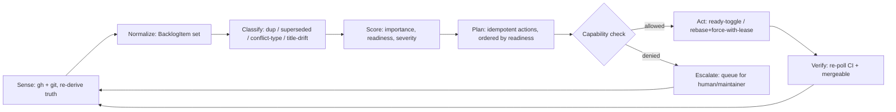

# Backlog Reconciliation as a System Problem

> A design write-up that abstracts the recurring "triage open issues/PRs, mark
> ready, close duplicates, rebase conflicts, rename mislabeled items" workflow
> into an explicit system. It captures the constraints a Cloud Agent actually
> hits in this repo (Linux-only validation, a jagged GitHub permission set,
> concurrently-merging humans/agents) so the same work can be reasoned about —
> and eventually automated — instead of redone by hand each time.

## 1. Problem statement

Given a repository whose issue/PR state changes concurrently (humans and other
agents merging in real time), continuously converge every open item to a
*terminal or clearly-owned* state — `merge-ready`, `closed`, or
`blocked(reason, owner)` — using only the capabilities the actor actually holds,
and never asserting more confidence than the available validation allows.

This is a **controller / reconciler**, not a one-shot script. In practice the
backlog mutates faster than a single plan survives: within a single grooming
session a gating PR can merge, its QA gate issue can close, and several new PRs
can appear. Any plan computed against a stale snapshot is wrong almost
immediately, so truth must be re-derived every cycle.

## 2. Observed-state model (the "sense" layer)

The unit of work is a `BacklogItem`, hydrated from several sources that must be
**re-derived every cycle**, never trusted from committed docs.

| Field | Source | Why it can't be cached |
|---|---|---|
| `mergeable`, `isDraft`, `reviewDecision` | `gh pr view` | Flips on any base movement; the API's flag can also lag (a branch flagged `CONFLICTING` may rebase clean) |
| `ci[]` per tier | `gh pr checks` | Re-runs on every force-push |
| `mergeBase`, branch commits | `git` | Determines the conflict class |
| `supersededBy` | **tree-diff vs `main`**, not titles | An item can look alive by title while its tree is older than `main` |
| `titleAccuracy` | branch contents vs title | A "Tech design" PR may actually carry implementation code |
| `blockedReason`, `owner` | derived | The real output of triage |

**Key principle:** in-repo status docs (`AGENTS.md`, progress trackers) are a
*lagging cache*, not ground truth. The reconciler treats them as hints and
derives ground truth from the live API + git on each pass.

## 3. Desired-state invariants

The loop tries to make all of these true:

1. Every `MERGEABLE` + CI-green item is **not** a draft.
2. Every duplicate / superseded item is **closed** with a stated reason.
3. Every conflicting branch is either **rebased clean** or `blocked` with an owner.
4. Every **title matches its branch contents**.
5. Every `blocked` item names *what* unblocks it and *who* can.

## 4. The control loop



The loop is **edge-triggered by staleness**: after any action — especially a
force-push — re-sense the affected items before reporting, because the action
itself invalidates the snapshot.

## 5. Scoring as an explicit function

Prioritization should be a pure, inspectable function rather than implicit
judgement:

```
priority(item) = w_sev   * severity        // user / risk impact
               + w_imp   * importance       // roadmap value
               + w_ready * readiness         // mergeable + CI-green + cloud-doable
               - w_block * blockedCost        // macOS-only / perms / semantic-merge penalty
```

`readiness` must fold in **`cloudDoable`** as a first-class axis: items whose
correctness is provable on the reachable validation tier (Linux) score higher
than items that carry a hard macOS-QA discount, even at equal severity.

## 6. Capability layer — the central constraint

The most important design fact is **capability asymmetry**: the actor's
permissions are jagged. Some mutations are allowed; many adjacent ones are not.

| Operation | Mechanism | Permitted? |
|---|---|---|
| Toggle draft -> ready | `markPullRequestReadyForReview` | Yes |
| Rebase + publish | `git push --force-with-lease` | Yes |
| Close PR | `closePullRequest` | No |
| Comment / label | `addComment` / `addLabels` | No |
| Rename / edit body | `updatePullRequest` | No |
| Merge | — | No |

A robust system **models capabilities explicitly** and routes any
out-of-capability action to an escalation queue *at plan time* — emitting a
structured handoff (with paste-ready title/comment text) instead of attempting
and failing an API call.

`git push --force-with-lease` deserves a specific mention: it is the
**compare-and-swap primitive** that makes branch mutation safe under
concurrency. It refuses the push if the remote moved since the branch was
sensed — exactly the optimistic-concurrency guard a multi-actor reconciler needs.

## 7. Concurrency, idempotency, and conflict classification

- **Idempotent actions.** "Ensure ready" and "ensure rebased onto `main@sha`"
  can be re-run safely every cycle — essential because the loop re-senses and
  may re-touch the same item.
- **Conflict classifier:**
  - *Mechanical* (context/text drift, stale status docs) -> auto-resolve;
    prefer `main` for superseded docs, then validate on Linux.
  - *Semantic* (two competing implementations of the same hot path) ->
    **abort, never guess**; emit `blocked(owner = author + macOS)`.
- **Supersession detector.** Diff the branch tree against `main`; if the branch
  is a subset/older tree, mark `superseded` regardless of title (rebasing it
  would *regress* `main`, so the correct action is close, not rebase).

## 8. The validation-oracle problem

Validation is **two-tier, with an unreachable tier**:

- **Reachable (authoritative for its scope):** Linux CI — Rust crates,
  `VoiceyCore`, SwiftLint — plus the macOS CI job (`build.yml` on `macos-15`),
  which compiles the macOS target and runs the macOS unit suite. The system can
  and must treat all of these as observable, automatically-closing gates.
- **Unreachable oracle:** live **mic / TCC / overlay manual QA** on a real Mac.
  This is the gate the reconciler can *never* close itself — it can only mark
  `blocked(owner = macOS)`. The distinction matters: a green macOS CI build
  proves the code *compiles and unit-tests* on macOS, but says nothing about
  on-device capture, permissions, or window behaviour.

Design implication: **a `ready` state must encode its evidence boundary.**
"Ready for review with Linux-green; macOS QA pending" is a distinct state from
"fully validated", and the system must never collapse the two.

## 9. Environment as a managed dependency

Test runs can require prerequisites that are missing from a fresh VM (system
dev packages, generated fixtures/artifacts). A system treats the **build/test
environment as a reconciled resource**: a declared, verified, self-healing
bootstrap manifest rather than ad-hoc installs mid-task — and ideally pushed
into the agent base image so every run starts converged.

## 10. What to add to make it robust

- **Derived-truth snapshot store** with a TTL of roughly one action; invalidate
  on self-emitted mutations.
- **`blockedReason` taxonomy** with a required `owner`:
  `{ conflict-semantic, macOS-QA, missing-capability, superseded, awaiting-dep }`
  — makes the backlog queryable ("everything only I can unblock" vs "everything
  waiting on a Mac").
- **Capability manifest** checked at plan time; out-of-capability ->
  structured handoff.
- **No-duplicate guard** encoded as a precondition predicate (the "don't re-open
  already-open work" rule as data, not prose).
- **Per-item audit trail**: state transitions + evidence links, so a reviewer
  sees "rebased onto `main@<sha>`, N tests green, macOS-QA pending" without
  reconstructing it.

## In one sentence

It is a **capability-aware reconciliation controller over a
concurrently-mutating backlog**, whose hard parts are re-deriving truth every
cycle, classifying conflicts as mechanical vs semantic, respecting a jagged
permission boundary by escalating instead of guessing, and never claiming
confidence beyond the reachable (Linux) validation tier when the real oracle
(macOS) is out of reach.
