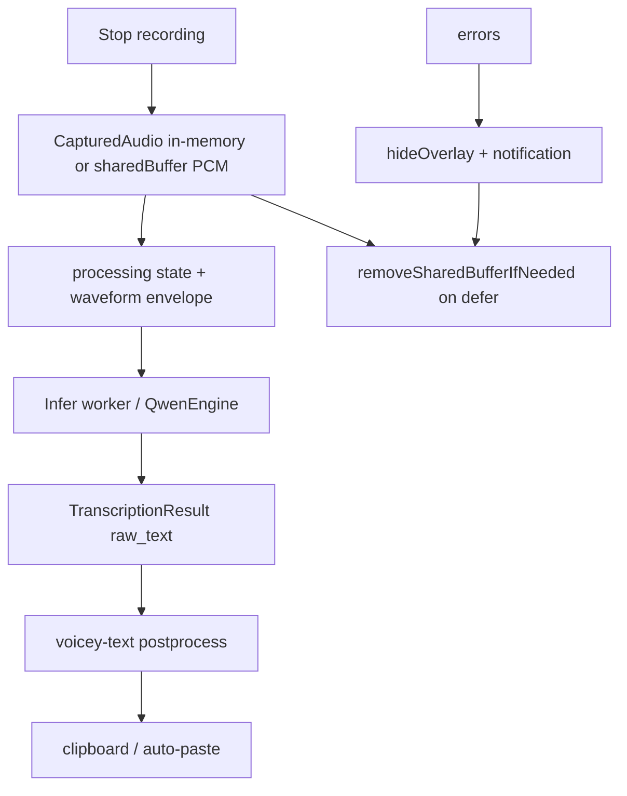

# Dictation session archive and failure golden corpus

## Status

**Design only** — no product code yet. Intended to turn real failed (or suspicious) dictation sessions into replayable artifacts for debugging, regression tests, and a future Voicey-specific benchmark set.

## Problem

When a dictation session “doesn’t work,” the user often cannot reconstruct what happened:

- **Hard failures** set `TranscriptionState.error`, show a notification, and hide the overlay; PCM in shared memory is removed in `defer { capturedAudio.removeSharedBufferIfNeeded() }` on the transcription path.
- **Soft failures** complete successfully but paste wrong text, empty text (overlay dismissed with no delivery), or steering echo that slipped through — there is no user-facing “this was wrong” capture.
- **CI goldens** under `Benchmarks/Golden/` are curated, tiny, and mostly **text contracts** (post-process, steering) plus synthetic WAV tones for runtime smoke — not a growing corpus of real mic clips tied to app settings and screen context.

The user wants:

1. After a bad session, **one action** (e.g. a button) to **persist the recording** plus enough metadata to see **what was transcribed and how it failed**.
2. Optionally, a **setting to retain all sessions** (or a sampled subset) for later review.
3. A **path from stored sessions → benchmarks** (replay with `benchmark-transcribe`, add to a private or redacted corpus, export JSON fixtures).

## Definitions

| Term | Meaning |
|------|---------|
| **Utterance** | One stop-recording → transcribe → post-process → deliver cycle (hands-free may produce many per session). |
| **Session archive entry** | One persisted utterance: audio + structured metadata + outcome. |
| **Failure class** | Why the entry was saved (see below). |
| **Golden corpus (repo)** | Committed fixtures in `Benchmarks/Golden/` — deterministic, small, safe for CI. |
| **Golden corpus (local/user)** | Session archive exports the maintainer curates into repo goldens or a larger offline set (Common Voice–style). |

### Failure classes (initial taxonomy)

| Class | Trigger | Typical signals |
|-------|---------|-----------------|
| `error` | Pipeline threw or user saw error UI | `TranscriptionState.error`, capture/infer/post-process error strings |
| `empty_delivery` | Success path but nothing pasted | `hasDeliverableText == false` after post-process |
| `user_reported` | User taps “Save / Mark wrong” | Explicit UI on completed or error overlay |
| `auto_retained` | Setting “keep all utterances” | Every utterance when opt-in enabled |
| `steering_suspect` | Optional heuristic | e.g. high steering-term overlap in raw vs cleaned text (future) |

Quality failures and infrastructure failures share the same **archive shape**; classification is metadata only.

## Current architecture (relevant facts)



- PCM lifetime: [`CapturedAudio`](../../Sources/Voicey/Runtime/PCMBufferHandle.swift) shared buffers live in temp until `removeSharedBufferIfNeeded()`.
- Steering snapshot: [`ScreenContextStore`](../../Sources/Voicey/Transcription/ScreenContextStore.swift) holds accessibility (and optional OCR) context for the recording window; cleared at session boundaries — must be **snapshotted into the archive** before clear if we want replay fidelity.
- Benchmark replay today: `Voicey benchmark-transcribe`, Common Voice harness (`scripts/benchmark_common_voice.py`), golden WAV under `Benchmarks/Golden/` — all assume **16 kHz mono WAV** (or PCM the loader understands).

**Implication:** persistence must happen **before** PCM teardown, on a background queue, copying bytes to Application Support (or user-chosen folder). The UI button must either retain a handle until save completes or copy synchronously on the main path that already owns `CapturedAudio`.

## Proposed system: Dictation Session Archive

### Responsibilities

| Component | Layer | Role |
|-----------|-------|------|
| `UtteranceArchiveRecord` | VoiceyCore (types + JSON Codable) | Stable schema for manifest entries; Linux-testable encoding |
| `SessionArchiveStore` | Swift (`Sources/Voicey/Utilities/` or `Transcription/`) | Write/read entries under Application Support, retention, export |
| `UtteranceArchiveCoordinator` | App (`AppDelegate` hook) | Build record at end of utterance; respect settings; hand off async write |
| UI | Overlay + Settings | “Save recording”, optional “Mark as wrong”, history viewer (later) |
| Export CLI | Extend benchmark CLI | `Voicey benchmark-export-archive`, import folder → JSONL for CI |

Keep **heavy logic and schema** in VoiceyCore where possible; keep **file I/O and AppKit** in the app target.

### On-disk layout (v1)

```
~/Library/Application Support/Voicey/SessionArchive/
  index.jsonl          # append-only manifest (one JSON object per line)
  audio/
    {uuid}.wav         # 16 kHz mono PCM16 (same as golden generators)
  snapshots/           # optional, when screen context was enabled
    {uuid}.json        # redacted ScreenContextSnapshot + exposure flags
```

**`index.jsonl` record (sketch):**

```json
{
  "id": "uuid",
  "created_at": "ISO8601",
  "failure_class": "user_reported",
  "outcome": "completed",
  "error_message": null,
  "model_id": "qwen3-asr-1.7b-bf16",
  "language_id": "en",
  "audio_seconds": 3.2,
  "audio_path": "audio/{uuid}.wav",
  "raw_text": "...",
  "processed_text": "...",
  "steering_terms": ["..."],
  "decoder_context_sha256": "...",
  "glossary_enabled": true,
  "screen_context_enabled": true,
  "snapshot_path": "snapshots/{uuid}.json",
  "app_bundle_id": "com.example.app",
  "voicey_version": "…",
  "runtime": "multiprocess"
}
```

- Store **full** `decoder_context` only when user enables “include steering text in exports” (default off) — it may contain on-screen secrets.
- Always store **hashes + term lists** for regression debugging when full context is omitted.

WAV writing can reuse Rust (`voicey-capture` already has `wav` module and `RecordFixture`) or a small Swift PCM→WAV helper aligned with `scripts/generate_golden_fixtures.py` (16 kHz, mono, s16le).

### User-facing modes

1. **On-demand save (MVP)**  
   - When overlay is in `.error` or after `.completed`, show secondary action: **“Save recording…”**  
   - Requires keeping a **pending archive payload** in memory (or a temp copy on disk) until dismissed or saved — max one utterance at a time is enough for MVP.  
   - On save: write WAV + manifest line; toast with “Reveal in Finder”.

2. **“Mark transcription wrong” (MVP+)**  
   - Same as save but sets `failure_class: user_reported` even when outcome was `completed`.  
   - Optional menubar item: “Save last utterance” within N minutes if overlay already closed (needs retained last payload — bounded memory/disk).

3. **Retain all utterances (opt-in setting)**  
   - Settings → Privacy → “Keep local copies of dictation audio” with clear copy about disk use and sensitivity.  
   - `UtteranceArchiveCoordinator` writes every utterance with `failure_class: auto_retained`; optional cap (e.g. last 500 entries or 2 GB) with LRU pruning of WAV files not referenced by index.

4. **Session browser (later)**  
   - Settings tab or separate window: filter by failure class, date, model; play audio; copy raw/processed text; export selection.

### Integration with golden datasets

| Step | Action |
|------|--------|
| Curate | Maintainer picks entries from local archive (redact snapshot text if committing). |
| Export | CLI produces `Benchmarks/Corpus/dictation/{case_id}/` with `audio.wav`, `expected.txt` (optional), `metadata.json` mirroring archive record. |
| Replay | `make benchmark-transcribe` / `Voicey benchmark-transcribe --wav …` with same model and `--post-process` flags; compare to stored raw/processed text. |
| CI | Only **checked-in, non-PII** clips become goldens; local archive never auto-commits. |
| Steering/post-process | For text-only regressions, export **JSON golden** inputs from archive metadata (`raw_text`, `decoder_context`, `steering_terms`) without audio — same pattern as `Benchmarks/Golden/postprocess/`. |

Relationship to [Common Voice benchmark](../../Benchmarks/CommonVoice.md): Common Voice is **third-party read speech with reference transcripts**; session archive is **first-party dictation with implicit “reference” = user judgement or later manual annotation**. They complement each other.

### Privacy, security, retention

- Default **off** for automatic retention; on-demand save is explicit.
- Screen context snapshots may contain passwords, messages, tokens — **never upload by default**; export flows should warn and offer redaction (strip `corpus_chunks`, keep term list only).
- Support **Delete all archive data** in Settings and exclude archive directory from iCloud backup if applicable (`URLResourceKey.isExcludedFromBackupKey`).
- Document in user-facing privacy copy; align with Accessibility/Screen Recording permission story.

### Hands-free and incremental paths

Hands-free utterances share the same archive unit but differ in orchestration ([`AppDelegate` flush paths](../../Sources/Voicey/App/AppDelegate.swift)):

- Each flushed utterance should produce its own archive record when retention triggers.
- Background jobs (`HandsFreeBackgroundTranscriptionJob`) already carry envelope + duration — wire archive at `deliverHandsFreeTranscription` / error handlers analogous to manual hotkey.
- Incremental partial text: store `partial_transcription` at failure time for debugging streaming issues (#138).

### Testing strategy

| Layer | Test |
|-------|------|
| VoiceyCore | JSON encode/decode round-trip for `UtteranceArchiveRecord`; retention policy pure functions |
| Swift unit | Mock store writes index + fake WAV; coordinator called with fixture `CapturedAudio.inMemory` |
| Rust (optional) | WAV bytes match golden generator spec |
| Linux CI | Schema tests only (no AppKit) |
| macOS manual | [`docs/MACOS_MANUAL_QA.md`](../MACOS_MANUAL_QA.md) rows: save on error, save on wrong completion, opt-in retain, export + replay |

## Phased implementation

### Phase 0 — Schema and store (no UI)

- VoiceyCore types + `SessionArchiveStore` write WAV + append `index.jsonl`.
- Hook from a single code path (manual hotkey success/error) behind `VOICEY_SESSION_ARCHIVE=1` env for dogfooding.

### Phase 1 — Overlay “Save recording”

- Pending utterance payload; button on error and completed states; Finder reveal.
- Do not block paste/delivery on disk write (async copy).

### Phase 2 — Settings + retain-all + pruning

- User defaults, disk cap, delete-all.

### Phase 3 — Export and benchmark glue

- CLI export subset to folder; document workflow in `Benchmarks/Golden/README.md` § “Dictation corpus exports”.
- Optional: script to promote archive entry → committed golden JSON for post-process-only bugs.

### Phase 4 — In-app browser and annotations

- User edits “expected text” for entries; export produces WER-ready pairs for private eval.

## Non-goals (initial)

- Cloud sync or multi-device sharing of recordings.
- Automatic commit of user audio into the public git repo.
- Replacing Common Voice or building a full WER pipeline inside the menubar app.
- Storing raw mic indefinitely when the user did not opt in or explicitly save.

## Open questions

1. **Empty delivery**: auto-prompt “Save this clip?” when post-process yields whitespace-only, or only via settings?
2. **Overlay UX on error**: keep overlay visible until user dismisses (enabling save) vs. notification action “Save last failure”?
3. **Single vs. multi-utterance buffer**: is “last utterance only” sufficient for v1?
4. **Legal/copy**: exact wording for opt-in retention in settings (medical/legal dictation sensitivity).
5. **Issue tracking**: single GitHub issue for MVP vs. epic with sub-issues per phase?

## Acceptance criteria (when implemented)

- [ ] User can save audio + raw/processed text + error message from a failed utterance without re-recording.
- [ ] Saved clip replays through existing `benchmark-transcribe` path with matching model settings documented in metadata.
- [ ] Opt-in retain-all respects a documented disk bound and can be wiped from Settings.
- [ ] No screen-context plaintext in default exports; steering secrets require explicit opt-in.
- [ ] Hands-free and manual hotkey paths both supported.

## Related docs and code

- Architecture map: [`docs/ARCHITECTURE.md`](../ARCHITECTURE.md)
- Golden benchmarks: [`Benchmarks/Golden/README.md`](../../Benchmarks/Golden/README.md)
- Common Voice harness: [`Benchmarks/CommonVoice.md`](../../Benchmarks/CommonVoice.md)
- Steering sanitizer (text goldens): [`docs/explorations/transcription-output-steering-sanitizer.md`](transcription-output-steering-sanitizer.md)
