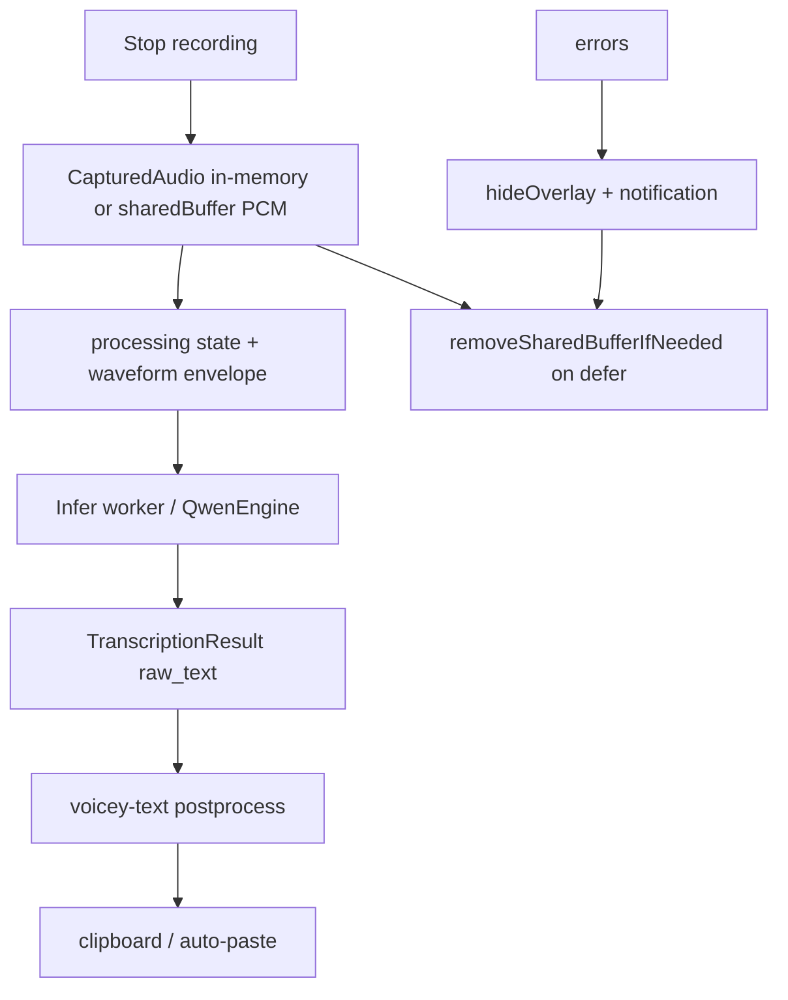
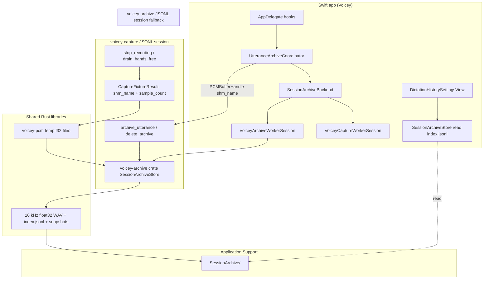

# Dictation session archive and failure golden corpus

## Status

**Partially implemented** — opt-in local retention, Settings history panel, and utterance hooks on manual/hands-free paths. Export CLI and benchmark glue remain future work (see Phases below).

## Problem

When a dictation session “doesn’t work,” the user often cannot reconstruct what happened:

- **Hard failures** set `TranscriptionState.error`, show a notification, and hide the overlay; PCM in shared memory is removed in `defer { capturedAudio.removeSharedBufferIfNeeded() }` on the transcription path.
- **Soft failures** complete successfully but paste wrong text, empty text (overlay dismissed with no delivery), or steering echo that slipped through — nothing is kept for review.
- **CI goldens** under `Benchmarks/Golden/` are curated, tiny, and mostly **text contracts** (post-process, steering) plus synthetic WAV tones for runtime smoke — not a growing corpus of real mic clips tied to app settings and screen context.

The product shape is a **single opt-in feature**:

1. **Setting off (default)** — Current behavior: no local archive, no history UI.
2. **Setting on** — Every utterance is **retained on disk** (audio + metadata). A **history panel** in Settings lists all retained recordings so the user can play audio, read raw/processed text, and see errors/outcomes (including failures after the overlay has closed).
3. **Export path** — Maintainer curates entries into benchmarks (`benchmark-transcribe`, JSON goldens, optional private corpus).

There is **no** per-utterance “Save recording” on the overlay, menubar “save last utterance,” or separate “mark wrong” save flow.

## Definitions

| Term | Meaning |
|------|---------|
| **Utterance** | One stop-recording → transcribe → post-process → deliver cycle (hands-free may produce many per session). |
| **Session archive entry** | One persisted utterance: audio + structured metadata + outcome. |
| **Outcome** | How the utterance ended (`completed`, `empty_delivery`, `error`) — metadata for filtering in the panel, not a save trigger. |
| **Golden corpus (repo)** | Committed fixtures in `Benchmarks/Golden/` — deterministic, small, safe for CI. |
| **Golden corpus (local/user)** | Session archive exports the maintainer curates into repo goldens or a larger offline set (Common Voice–style). |

### Outcomes (metadata for the history panel)

| Outcome | Meaning |
|---------|---------|
| `completed` | Post-process produced deliverable text (whether or not paste succeeded). |
| `empty_delivery` | Pipeline succeeded but no deliverable text after post-process. |
| `error` | Capture, infer, or post-process failed (`error_message` set). |

## Current architecture (relevant facts)



- PCM lifetime: [`CapturedAudio`](../../Sources/Voicey/Runtime/PCMBufferHandle.swift) shared buffers live in temp until `removeSharedBufferIfNeeded()`.
- Steering snapshot: [`ScreenContextStore`](../../Sources/Voicey/Transcription/ScreenContextStore.swift) holds accessibility (and optional OCR) context for the recording window; cleared at session boundaries — must be **snapshotted into the archive** before clear if we want replay fidelity.
- Benchmark replay today: `Voicey benchmark-transcribe`, Common Voice harness (`scripts/benchmark_common_voice.py`), golden WAV under `Benchmarks/Golden/` — all assume **16 kHz mono WAV** (or PCM the loader understands).

**Implication:** when the setting is on, persistence must start **before** PCM teardown. On the Rust capture path, archive IPC passes only the **`voicey_pcm_*` name** so samples are read inside the worker, not in Swift.

## Runtime architecture (implemented)

Core pieces and shared crates:



### What each piece owns

| Piece | Owns | Shares |
|-------|------|--------|
| **`voicey-pcm`** | Temp `{voicey_pcm_uuid}.pcm` (mono f32 LE) | Used by capture stop/drain, infer handoff, archive read |
| **`voicey-capture`** | Mic stream, stop → write PCM fixture, **`archive_utterance`** IPC | Links **`voicey-archive`** for disk writes on the default path |
| **`voicey-archive` crate** | Schema, WAV, `index.jsonl`, retention (500) | Used by capture IPC and standalone `voicey-archive` binary |
| **`voicey-archive` binary** | Same JSONL as crate (`append_utterance`, `delete_all`) | Fallback when AVFoundation capture (`samples` array) or no capture session |
| **VoiceyCore** | `UtteranceArchiveRecord` Codable (UI decode) | JSON lines written by Rust |
| **Swift host** | When to archive, metadata, Settings UI, playback | Routes via **`SessionArchiveBackend`**: capture first, archive worker second |

### Capture IPC recap (audio handoff)

| Request | Returns |
|---------|---------|
| `stop_recording` | `capture_fixture_result`: **`shm_name`**, **`sample_count`**, `sample_rate` (16000) — not inline samples |
| `drain_hands_free_utterance` | Same fixture shape for the utterance slice |
| `read_captured_samples` | Inline **`samples`** `[f32]` for incremental streaming only |
| `archive_utterance` | `archive_result`: reads **`pcm_shm`** (or inline samples) → **`voicey-archive`** store |
| `delete_archive` | Wipes archive root via shared store |

## Proposed system: Dictation Session Archive

### Responsibilities

| Component | Layer | Role |
|-----------|-------|------|
| `voicey-archive` crate | Rust | WAV, manifest, retention, schema (Linux-tested) |
| `voicey-capture` | Rust | Hot-path **`archive_utterance`** on existing JSONL session |
| `UtteranceArchiveRecord` | VoiceyCore | Decode `index.jsonl` for Settings UI |
| `SessionArchiveBackend` | Swift | Route to capture vs archive worker |
| `UtteranceArchiveCoordinator` | Swift | Metadata + `pcm_shm` wire format |
| UI | Swift | Toggle, history panel, delete-all |

Keep **heavy logic and schema** in Rust (`voicey-archive`); VoiceyCore mirrors record JSON for Swift UI decode; **file I/O and AppKit** stay out of the hot Swift path.

**Implemented:** capture-first archive IPC; `voicey-archive` binary as fallback for in-memory AVFoundation audio.

### On-disk layout (v1)

```
~/Library/Application Support/Voicey/SessionArchive/
  index.jsonl          # append-only manifest (one JSON object per line)
  audio/
    {uuid}.wav         # 16 kHz mono IEEE float32 (lossless infer replay; `audio_format`: `wav_f32`)
  snapshots/           # optional, when screen context was enabled
    {uuid}.json        # redacted ScreenContextSnapshot + exposure flags
```

**`index.jsonl` record (sketch):**

```json
{
  "id": "uuid",
  "created_at": "ISO8601",
  "outcome": "error",
  "error_message": "…",
  "model_id": "qwen3-asr-1.7b-bf16",
  "language_id": "en",
  "audio_seconds": 3.2,
  "audio_path": "audio/{uuid}.wav",
  "audio_format": "wav_f32",
  "raw_text": "...",
  "processed_text": "...",
  "steering_terms": ["..."],
  "decoder_context_sha256": "...",
  "glossary_enabled": true,
  "screen_context_enabled": true,
  "snapshot_path": "snapshots/{uuid}.json",
  "app_bundle_id": "com.example.app",
  "voicey_version": "…",
  "runtime": "multiprocess"
}
```

- Store **full** `decoder_context` only when user enables “include steering text in exports” (default off) — it may contain on-screen secrets.
- Always store **hashes + term lists** for regression debugging when full context is omitted.

WAV writing lives in **`voicey-archive`** (`hound`, 16 kHz mono **float32** — bit-identical to infer input). Benchmark goldens may stay PCM16 WAV; loaders decode losslessly to f32 for the model.

### User-facing behavior

**Settings → Privacy (or Dictation) → “Keep dictation history locally”**

- Off by default; clear copy about disk use, sensitivity of audio and optional screen snapshots.
- When **on**:
  - Every utterance (manual hotkey and hands-free flush) appends an archive entry after transcribe/post-process completes or fails.
  - **History panel** shows a chronological list: time, duration, outcome badge, snippet of processed text (or error). Selecting a row opens detail: play `audio/{uuid}.wav`, full raw/processed text, model/settings, error string, optional snapshot summary.
  - Optional **disk cap** (e.g. last 500 entries or 2 GB) with LRU pruning of WAV/snapshot files unreferenced after index trim.
  - **Delete all archive data** wipes `SessionArchive/` and clears the panel.

The overlay and menubar stay unchanged — no save actions there.

### Integration with golden datasets

| Step | Action |
|------|--------|
| Curate | Maintainer picks entries from the history panel or `index.jsonl` (redact snapshot text if committing). |
| Export | CLI or panel action produces `Benchmarks/Corpus/dictation/{case_id}/` with `audio.wav`, `expected.txt` (optional), `metadata.json` mirroring archive record. |
| Replay | `make benchmark-transcribe` / `Voicey benchmark-transcribe --wav …` with same model and `--post-process` flags; compare to stored raw/processed text. |
| CI | Only **checked-in, non-PII** clips become goldens; local archive never auto-commits. |
| Steering/post-process | For text-only regressions, export **JSON golden** inputs from archive metadata (`raw_text`, `decoder_context`, `steering_terms`) without audio — same pattern as `Benchmarks/Golden/postprocess/`. |

Relationship to [Common Voice benchmark](../Benchmarks/CommonVoice.md): Common Voice is **third-party read speech with reference transcripts** (TSV + `clips/`, usually MP3 on disk); session archive is **first-party dictation at 16 kHz WAV** with transcripts from the app pipeline. They complement each other.

### Privacy, security, retention

- Default **off**; no audio written until the user enables history.
- Screen context snapshots may contain passwords, messages, tokens — **never upload by default**; export flows should warn and offer redaction (strip `corpus_chunks`, keep term list only).
- Exclude archive directory from iCloud backup where applicable (`URLResourceKey.isExcludedFromBackupKey`).
- Document in user-facing privacy copy; align with Accessibility/Screen Recording permission story.

### Hands-free and incremental paths

Hands-free utterances share the same archive unit but differ in orchestration ([`AppDelegate` flush paths](../../Sources/Voicey/App/AppDelegate.swift)):

- Each flushed utterance produces its own archive record when the setting is on.
- Wire archive at `deliverHandsFreeTranscription` and error handlers analogous to manual hotkey.
- On failure, store `partial_transcription` when available for debugging streaming issues (#138).

### Testing strategy

| Layer | Test |
|-------|------|
| VoiceyCore | JSON encode/decode round-trip for `UtteranceArchiveRecord`; retention policy pure functions |
| Swift unit | Mock store writes index + fake WAV; coordinator runs only when setting enabled |
| Rust (optional) | WAV bytes match golden generator spec |
| Linux CI | Schema tests only (no AppKit) |
| macOS manual | [`docs/MACOS_MANUAL_QA.md`](../MACOS_MANUAL_QA.md) rows: toggle on retains utterances, panel lists/plays, delete-all, export + replay |
| Replay script | `scripts/replay_session_archive.py` — batch `benchmark-transcribe` vs `index.jsonl` (optional multi-model) |

## Phased implementation

### Phase 0 — Schema and store

- VoiceyCore types + `SessionArchiveStore` write WAV + append `index.jsonl`.
- Hook from manual hotkey path when setting enabled (or `VOICEY_SESSION_ARCHIVE=1` for dogfooding).

### Phase 1 — Setting + coordinator on all utterance paths

- User default, privacy copy, async write without blocking delivery.
- Hands-free and error paths included; disk cap + delete-all.

### Phase 2 — History panel

- Settings UI: list, filter by outcome, detail + playback, reveal in Finder.

### Phase 3 — Export and benchmark glue

- CLI export subset to folder; document workflow in `Benchmarks/Golden/README.md` § “Dictation corpus exports”.
- Optional: script to promote archive entry → committed golden JSON for post-process-only bugs.

### Phase 4 — Annotations (optional)

- User edits “expected text” on an entry; export produces WER-ready pairs for private eval.

## Non-goals (initial)

- On-demand save from overlay, notifications, or menubar.
- Cloud sync or multi-device sharing of recordings.
- Automatic commit of user audio into the public git repo.
- Replacing Common Voice or building a full WER pipeline inside the menubar app.
- Storing audio when the setting is off.

## Open questions

1. **Legal/copy**: exact wording for opt-in retention (medical/legal dictation sensitivity).
2. **Panel placement**: dedicated Settings tab vs. section under Privacy vs. separate window.
3. **Issue tracking**: single GitHub issue for MVP vs. epic with sub-issues per phase.

## Acceptance criteria (when implemented)

- [ ] With history enabled, every utterance appears in the panel with audio, raw/processed text, and outcome/error metadata.
- [ ] With history disabled, no archive files are created.
- [ ] Clips replay through existing `benchmark-transcribe` with model settings documented in metadata.
- [ ] Disk cap and delete-all work; no screen-context plaintext in default exports.
- [ ] Hands-free and manual hotkey paths both supported.

## Related docs and code

- Architecture map: [`docs/ARCHITECTURE.md`](../ARCHITECTURE.md)
- Golden benchmarks: [`Benchmarks/Golden/README.md`](../../Benchmarks/Golden/README.md)
- Common Voice harness: [`Benchmarks/CommonVoice.md`](../../Benchmarks/CommonVoice.md)
- Steering sanitizer (text goldens): [`docs/explorations/transcription-output-steering-sanitizer.md`](transcription-output-steering-sanitizer.md)
