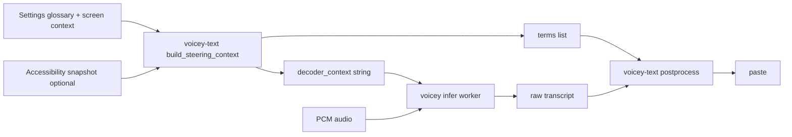

# Transcription quality evaluation — findings (June 2026)

Companion to the [ticklist](transcription-quality-eval-ticklist.md). Corpus: **200 LibriSpeech dev-clean clips** (deterministic seed `20260506`), model **`qwen3-asr-1.7b-bf16`**, unless noted.

**Full matrix output:** `benchmark-results/quality-matrix/20260617T102754Z/summary.md`

---

## How decoder steering works

Decoder steering biases **Qwen3-ASR before it decodes speech**, not after. It is separate from post-process cleanup and from LM Studio.

### Pipeline



1. **Term selection** (`voicey-text` / `build_steering_context`):
   - Manual glossary entries (comma/newline separated) if enabled.
   - Optional screen terms from BM25 over an accessibility snapshot (capped: 8 screen terms, 32 total, #191).
   - Built-in term `Voicey` is always prepended.

2. **Context formatting** (`TranscriptionGlossary` / `glossary::format_terms`):
   - Terms are joined into a single string prefixed with `Vocabulary: `.
   - Hard cap: **256 characters** (truncated if longer).

   Example:

   ```text
   Vocabulary: Voicey, Hof Brau, Ossipon, Sutter Street
   ```

3. **Injection into Qwen** (`Qwen3ASRModel.transcribe(..., context:)`):
   - The context string is passed to the MLX Qwen3-ASR API as **decoder context** (system-slot biasing in the speech-swift binding).
   - Spoken-language hint (`language: "English"`) is a separate parameter.

4. **Post-process safety net** (`voicey-text` `postprocess`):
   - The same `steering_terms` + `decoder_context` are sent to post-process so **steering echo** can be stripped if the model regurgitates vocabulary instead of speech (#162).

5. **LM Studio mode** (Settings):
   - When vocabulary mode is **After transcription (LM Studio)**, step 3 is **skipped** — terms are kept for LLM post-process only, not sent to Qwen.

### What it is not

- Not fuzzy spell-check on the transcript (see `vocabulary_repair.rs` for that).
- Not ITN (see `itn.rs`).
- Not unlimited context — long screen dumps are trimmed precisely because over-steering garbles ASR.

---

## Executive summary

| Finding | Result |
|---------|--------|
| Baseline 1.7b on read speech | **2.13% WER** — already strong |
| Default `voicey-text` post-process | **No change** on this corpus |
| **Decoder glossary steering** | **1.88% WER (−0.25 pp)** — clearest win |
| English language hint | 2.18% WER (+0.05 pp) — neutral/slightly worse here |
| Fuzzy vocabulary repair (post-ASR) | 2.28% proc WER (+0.15 pp) with broad glossary |
| Deterministic ITN | 2.18% proc WER (+0.05 pp) — hurts vs archaic references |
| Quiet (−12 dB) / noisy audio | ~2.11–2.18% — little change on studio speech |
| 0.6b model | Not evaluated (model not downloaded) |

**Conclusion:** On generic read speech, only **decoder steering** moved WER meaningfully. Post-ASR tricks need a **dictation-shaped eval** (read-aloud steering corpus, term recall) before product decisions.

---

## Full matrix (200 clips)

| Variant | raw WER | proc WER | Δ proc−raw | clips changed |
|---------|--------:|---------:|-----------:|--------------:|
| baseline-1.7b-raw | 2.13% | 2.13% | — | 0 |
| baseline-1.7b-proc | 2.13% | 2.13% | 0.00 | 0 |
| lang-english-1.7b-raw | 2.18% | 2.18% | — | 0 |
| steer-glossary-1.7b-raw | **1.88%** | **1.88%** | — | 0 |
| steer-glossary-1.7b-proc | **1.88%** | **1.88%** | 0.00 | 0 |
| repair-glossary-1.7b | 2.13% | 2.28% | +0.15 | 6 |
| itn-1.7b | 2.13% | 2.18% | +0.05 | 2 |
| audio-quiet-1.7b-raw | 2.11% | 2.11% | — | 0 |
| audio-noisy-1.7b-raw | 2.18% | 2.18% | — | 0 |
| model-0.6b-raw | *failed* | — | — | — |

Glossary for steer/repair variants: `eval_proper_noun_glossary.txt` (proper nouns from LibriSpeech error analysis).

---

## Per-option notes

### ASR layer

- **Model (1.7b):** Default for eval; sufficient on clean read speech.
- **Language hint:** Locking English did not help on this English literary corpus; still test on mixed-language or mis-detected clips.
- **Audio quality:** −12 dB and light noise did not materially change WER — need real mic / hands-free / Bluetooth clips for signal.

### Decoder steering

- Injecting `Vocabulary: …` into Qwen reduced WER **0.25 percentage points** with the eval glossary.
- Post-process added nothing on top once ASR was already steered (no echo soup on this set).
- **Risk:** Too many or irrelevant terms increase garble (see sanitizer doc, 256-char cap). Screen-context gate (#150) matters.

### Post-ASR: fuzzy repair (“spell checker”)

- Implemented in Rust (`vocabulary_repair.rs`): edit distance ≤ 1, token length ≥ 4, whole-word only.
- **Not** `NSSpellChecker` — avoids macOS-only / non-CI-parity path.
- With a **broad** glossary on LibriSpeech, repair caused false positives (+0.15 pp proc WER, 6 clips). First smoke run with distance ≤ 2 hit **17% proc WER** before tightening.
- **Verdict:** Keep for targeted glossaries + read-aloud eval; do not enable globally with screen soup.

### Post-ASR: ITN (deterministic rules)

- Rules for compounds (`to morrow` → `tomorrow`) and spoken titles (`mister` → `Mr.`).
- LibriSpeech references use archaic spacing (`TO MORROW`) — ITN **raises** WER slightly here but improves **user-facing** prose.
- **Verdict:** Ship as **optional / prose-only** profile, not default for code dictation. **Rules before LLM ITN.**

### LM Studio vocabulary mode

- **Implemented** in app (Settings): skips decoder context; calls local OpenAI-compatible `/v1/chat/completions` after `voicey-text`.
- **Not in offline matrix** — requires LM Studio server + loaded model.
- **Verdict:** See below.

---

## LM Studio: worth keeping?

**Yes, as an optional mode — but not as the primary quality lever.**

| | Decoder steering | LM Studio post-process |
|--|------------------|------------------------|
| When it runs | Before ASR | After ASR |
| Latency | None extra | +HTTP LLM round-trip |
| Evidence on 200-clip matrix | **−0.25 pp WER** | Not measured offline |
| Failure mode | ASR garble if over-steered | Hallucination / rewrite |
| CI / parity | Fully in Rust + infer | External server; hard to golden-test |
| Best for | Terms you expect to **hear** | Fixing **spelling** when ASR is close |

**Recommendation:**

1. **Default remains decoder steering** for glossary + screen terms.
2. **Keep LM Studio mode** for users who prefer not to bias ASR (long screen dumps, echo sensitivity) or who already run Gemma locally for other tasks.
3. **Before promoting LM Studio:** add a text golden set + optional macOS eval with LM Studio running; compare against fuzzy repair on read-aloud corpus.
4. Do **not** invest in Gemma prompt sweeps on LibriSpeech WER — wrong metric.

---

## What to eval next

1. Merge **read-aloud steering corpus** — metric: **term recall**, not WER.
2. Download **0.6b** and rerun `model-0.6b-raw`.
3. **Incremental vs batch** on filename / homophone lines.
4. **Session archive** replay for real failure clips.
5. LM Studio A/B when server available.

---

## Reproduce

```bash
make build build-rust
make eval-transcription-quality-matrix-smoke
make eval-transcription-quality-matrix ARGS='--limit 200'
```
